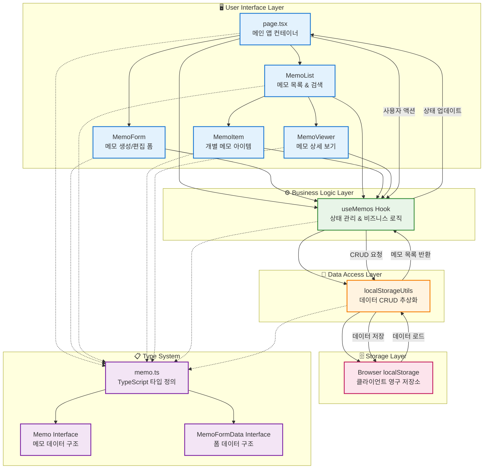

# 메모 앱 시스템 아키텍처

## 개요

메모 앱은 React 기반의 클라이언트 사이드 애플리케이션으로, 사용자가 메모를 생성, 편집, 삭제, 검색할 수 있는 기능을 제공합니다. 브라우저의 localStorage를 사용하여 데이터를 영구 저장하며, TypeScript를 통해 타입 안전성을 보장합니다.

## 시스템 아키텍처 다이어그램

## 각 계층별 상세 설명

### 🖥️ **사용자 인터페이스 계층 (UI Layer)**

**역할**: 사용자와 상호작용하는 React 컴포넌트들로 구성된 프레젠테이션 계층

- **`page.tsx`**: 애플리케이션의 메인 컨테이너로, 전체 레이아웃과 상태를 관리
- **`MemoForm`**: 새 메모 생성 및 기존 메모 편집을 위한 모달 폼 컴포넌트
- **`MemoList`**: 메모 목록 표시, 검색 및 카테고리 필터링 기능 제공
- **`MemoItem`**: 개별 메모의 미리보기와 기본 액션(편집, 삭제) 제공
- **`MemoViewer`**: 메모의 상세 내용을 읽기 전용으로 표시

### ⚙️ **비즈니스 로직 계층 (Business Logic Layer)**

**역할**: 애플리케이션의 핵심 비즈니스 로직과 상태 관리를 담당

- **`useMemos`**: 커스텀 React 훅으로 다음 기능들을 제공
  - 메모 CRUD 연산 (생성, 읽기, 업데이트, 삭제)
  - 실시간 검색 및 카테고리 필터링
  - 메모 통계 계산 (총 개수, 카테고리별 분류)
  - 상태 동기화 및 리액티브 업데이트

### 💾 **데이터 액세스 계층 (Data Access Layer)**

**역할**: 데이터 저장소에 대한 추상화된 인터페이스 제공

- **`localStorageUtils`**: localStorage API를 래핑한 유틸리티로 다음 기능 제공
  - 메모 CRUD 연산의 구체적 구현
  - 에러 핸들링 및 데이터 검증
  - 브라우저 호환성 처리 (SSR 환경 고려)

### 🗄️ **데이터 저장소 계층 (Storage Layer)**

**역할**: 실제 데이터 영구 저장을 담당

- **Browser localStorage**: 클라이언트 사이드 영구 저장소
  - JSON 형태로 메모 데이터 저장
  - 브라우저 세션 간 데이터 지속성 보장
  - 도메인별 격리된 저장 공간

### 📋 **타입 시스템 (Type System)**

**역할**: TypeScript를 통한 컴파일 타임 타입 안전성 보장

- **`Memo`**: 완전한 메모 객체의 구조 정의
- **`MemoFormData`**: 폼에서 사용하는 메모 데이터 구조
- **카테고리 타입들**: 메모 분류를 위한 열거형 타입들

## 데이터 플로우

### 📖 **읽기 플로우**
1. 애플리케이션 초기화 시 `useMemos`가 `localStorageUtils.getMemos()` 호출
2. `localStorageUtils`가 localStorage에서 데이터 읽기
3. 파싱된 메모 배열을 `useMemos`로 반환
4. `useMemos`가 React 상태 업데이트
5. UI 컴포넌트들이 새로운 상태를 렌더링

### ✍️ **쓰기 플로우**
1. 사용자가 UI에서 액션 수행 (생성, 편집, 삭제)
2. UI 컴포넌트가 `useMemos`의 적절한 함수 호출
3. `useMemos`가 비즈니스 로직 처리 후 `localStorageUtils` 호출
4. `localStorageUtils`가 localStorage에 데이터 저장
5. `useMemos`가 로컬 상태 동기화
6. UI가 자동으로 리렌더링되어 변경사항 반영

## 아키텍처의 특징

### ✅ **장점**
- **관심사의 분리**: 각 계층이 명확한 책임을 가짐
- **재사용성**: 커스텀 훅을 통한 로직 재사용
- **타입 안전성**: TypeScript를 통한 컴파일 타임 오류 방지
- **테스트 용이성**: 계층별 독립적인 테스트 가능
- **확장성**: 새로운 기능 추가 시 해당 계층만 수정

### ⚠️ **제한사항**
- **클라이언트 저장소 의존**: localStorage 용량 제한 및 브라우저별 차이
- **실시간 동기화 불가**: 다중 탭 간 실시간 동기화 미지원
- **서버 백업 부재**: 데이터 손실 위험 존재

## 향후 개선 방향

1. **백엔드 통합**: 서버 API 연동을 통한 데이터 백업 및 동기화
2. **상태 관리 라이브러리**: Redux 또는 Zustand 도입으로 복잡한 상태 관리
3. **오프라인 지원**: Service Worker를 통한 오프라인 기능
4. **실시간 동기화**: WebSocket 또는 Server-Sent Events 활용